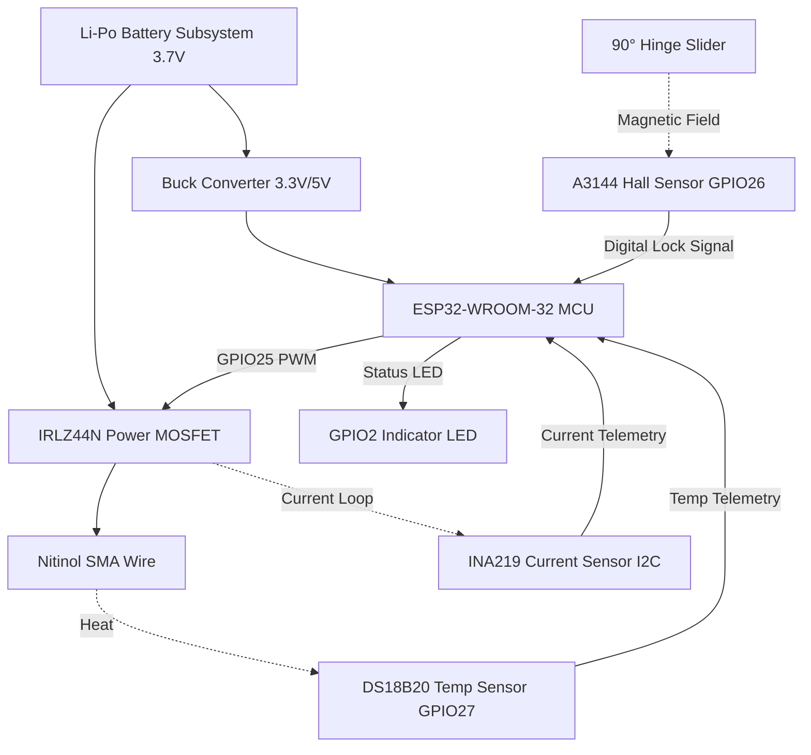
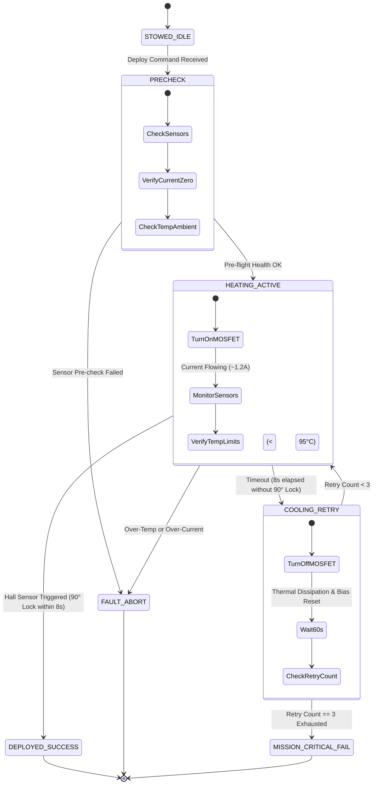

<div align="center">

# 🛰️ SATFOLD / ORBITGUARD
### **Smart Resettable SMA Solar Array Deployment Mechanism for CubeSats**
*Next-Generation Spacecraft Reliability: Replacing Fragile One-Shot Burn-Wires with Controllable Nitinol Actuation*

[](https://sih.gov.in)
[](#-5-electronics--avionics-architecture)
[](#-3-the-shape-memory-alloy-sma-solution)
[](LICENSE)
[](#-10-repository-deliverables)

<br/>

> **"In space exploration, no power means mission lost. SATFOLD ensures CubeSat solar panels deploy smoothly, reliably, and testably every single time."**

---

</div>

## 📑 Table of Contents
- [📌 1. Executive Overview](#-1-executive-overview)
- [⚠️ 2. The Problem with Legacy Solutions](#️-2-the-problem-with-legacy-solutions)
- [🔬 3. The Shape Memory Alloy (SMA) Solution](#-3-the-shape-memory-alloy-sma-solution)
- [⚙️ 4. Mechanical Kinematics & Stroke Amplification](#️-4-mechanical-kinematics--stroke-amplification)
- [🧠 5. Electronics & Avionics Architecture](#-5-electronics--avionics-architecture)
- [🔌 6. Electrical Schematic & Wiring Map](#-6-electrical-schematic--wiring-map)
- [🔄 7. Autonomous Deployment State Machine](#-7-autonomous-deployment-state-machine)
- [⚡ 8. Power System & Thermal Protection](#-8-power-system--thermal-protection)
- [📋 9. Bill of Materials (BOM)](#-9-bill-of-materials-bom)
- [🛠️ 10. Assembly & Testing Guide](#️-10-assembly--testing-guide)
- [📑 11. Key Component Datasheets](#-11-key-component-datasheets)
- [📦 12. Repository Deliverables](#-12-repository-deliverables)
- [🚀 13. Future Roadmap & Flight Readiness](#-13-future-roadmap--flight-readiness)
- [👥 14. Team & Smart India Hackathon (SIH)](#-14-team--smart-india-hackathon-sih)

---

## 📌 1. Executive Overview

**SATFOLD** (ORBITGUARD) is a flight-demonstration solar array deployment mechanism engineered specifically for **CubeSats (1U to 6U nanosatellites)**.

During rocket launch, solar arrays are stowed flush against the satellite chassis to survive extreme vibration and acoustic turbulence. Upon orbital injection, these panels **must unfold a full 90 degrees** toward the Sun. If this single mechanical step fails, the satellite exhausts its primary battery in hours and dies as orbital space debris.

SATFOLD replaces antiquated, single-use, pyro/burn-wire hold-down mechanisms with a **repeatable, non-explosive, controllable Nitinol Shape Memory Alloy (SMA) actuator** driven by a closed-loop **ESP32 microcontroller subsystem**.

```
  +--------------------+       Joule Heating       +----------------------+
  |  ESP32 Controller  | ------------------------> | Nitinol SMA Actuator |
  +--------------------+                           +----------------------+
            ^                                                  |
            | Telemetry (Current / Temp / Hall)                | ~4% Contraction
            |                                                  v
  +--------------------+        Rotates 90°        +----------------------+
  | 3-Tier Sensor Net  | <------------------------ | Slider-Crank Hinge   |
  +--------------------+                           +----------------------+
```

---

## ⚠️ 2. The Problem with Legacy Solutions

Traditional CubeSats rely on **burn-wire release mechanisms**: a mechanical spring is held under compression by a thin nylon/Dyneema fishing line, and an electrical resistor heats up to melt/burn the line, releasing the spring.

### Flaws of the Burn-Wire Method:
1. **One-Shot Only (Non-Testable):** Once burned, the flight unit cannot be tested without manual re-lacing. Engineers can never test the exact hardware configuration that flies.
2. **Violent Snap Loads:** Spring-driven release creates high shock loads (*pyroshock equivalence*), risking delamination of delicate solar cells and optical misalignments.
3. **Zero Deployment Telemetry:** Standard burn-wires provide no confirmation whether the panel reached full lock or got snagged halfway.
4. **Thermal & Debris Risks:** Molten polymer remnants can outgas in a vacuum, contaminating camera lenses and star trackers.

### 📊 Comparative Analysis: Legacy vs. SATFOLD

| Feature / Metric | Legacy Burn-Wire + Spring | SATFOLD / ORBITGUARD (Nitinol SMA + ESP32) |
| :--- | :--- | :--- |
| **Testability** | ❌ 1-Shot Only (Destructive) | ✅ **100% Ground Resettable & Repeatable** |
| **Motion Profile** | ❌ Violent spring snap (High Shock) | ✅ **Smooth, rate-controlled linear pull** |
| **Telemetry & Feedback** | ❌ Blind deployment (No feedback) | ✅ **Real-time Hall, Current & Temp Telemetry** |
| **Fault Recovery** | ❌ None (Single point of failure) | ✅ **Autonomous 3-stage retry & thermal safety** |
| **Outgassing / Debris** | ❌ Polymer melt residue | ✅ **Zero debris, clean solid-state alloy** |
| **Ground Calibration** | ❌ Requires manual rebuild | ✅ **Automated reset via passive bias spring** |

---

## 🔬 3. The Shape Memory Alloy (SMA) Solution

SATFOLD utilizes **Nitinol (Nickel-Titanium Alloy)** wire for solid-state actuation.

```
       Cool (Martensite Phase)                      Heated (Austenite Phase)
   [ Soft, stretchable lattice ]                [ Rigid, contracted cubic lattice ]
  ---------------------------------  ---(Joule Heat)--->  =======================
           Length: 200 mm                                      Length: 192 mm
                                                               (ΔL = 7-8 mm pull)
```

### Physics of Nitinol:
1. **Martensite Phase (Room/Cold Temperature):** Nitinol has a flexible, twinned monoclinic crystal lattice. In this state, it is soft and easily extended by a bias spring.
2. **Austenite Phase (Transition Temperature ~65°C - 90°C):** When an electric current is passed through the wire (Joule heating: $P = I^2 R$), the crystal lattice snaps into a highly ordered, rigid body-centered cubic structure.
3. **Contraction Pull:** The wire shrinks by **3% to 4% of its active length**, delivering a pulling force exceeding **15 to 25 N**—far more than needed to actuate satellite hinges.
4. **Passive Reset:** When power is cut, the wire cools back to Martensite. A counter-acting mechanical bias spring smoothly pulls the slider back to its starting position, priming it for the next deployment cycle.

---

## ⚙️ 4. Mechanical Kinematics & Stroke Amplification

### The Stroke Challenge
A $20\text{ cm}$ Nitinol wire yields $\approx 7\text{ mm to }8\text{ mm}$ of linear stroke ($\Delta L$). However, unfolding a solar panel requires rotating the hinge by **$90^\circ$**.

### 🔗 The Kinematic Amplification Chain
SATFOLD translates this micro-stroke into a full 90° sweep using a high-efficiency **slider-crank mechanism**:

```
[ Nitinol Wire ] ---> Pulls ---> [ Linear Slider Block (Track-guided) ]
                                            |
                                            v
                                 [ Rigid Linkage Rod ]
                                            |
                                            v
                                 [ Crank Lever Arm ] ---> Rotates Hinge 90°
                                            |
                                            v
                                 [ Solar Panel Array ]
```

1. **Linear Track & Slider:** The SMA wire connects to an engineered slider running along precision low-friction rails.
2. **Link Rod:** A stiff connecting arm transfers linear force directly to the hinge crank.
3. **Hinge Crank Lever:** Acts like a bicycle pedal crank, turning the short linear push into a torque arc.
4. **Over-Center Detent / Latch:** At $90^\circ$, a mechanical detent locks the panel firmly in place to prevent back-play in zero gravity.
5. **Reset Bias Spring:** Provides just enough return tension to reset the slider once the wire cools, enabling infinite non-destructive tests in the lab.

---

## 🧠 5. Electronics & Avionics Architecture

The deployment sequence is governed by a dedicated **ESP32 microcontroller**, coupled with a **3-tier closed-loop sensor grid**.



### 🛰️ The 3-Tier Sensor Network

1. **🧲 Hall Effect Sensor (`GPIO 26`):**
   - Monitors a neodymium magnet mounted on the slider carriage.
   - When the slider reaches the end of stroke ($90^\circ$), the sensor triggers a digital active-LOW interrupt to confirm positive latch.
2. **⚡ INA219 Voltage/Current Sensor (`I2C`):**
   - Continuously measures current flow through the Nitinol wire.
   - **$0\text{ A}$ detected:** Wire snapped or terminal disconnected (Open circuit fault).
   - **Overcurrent detected:** Short circuit condition — instantaneous software cutoff.
3. **🌡️ DS18B20 Digital Temperature Sensor (`GPIO 27`):**
   - Attached directly to the SMA wire with Kapton tape.
   - Ensures the Nitinol reaches transition temperature ($\approx 75^\circ\text{C}$) while preventing thermal runaway ($>95^\circ\text{C}$) that would degrade memory properties.

---

## 🔌 6. Electrical Schematic & Wiring Map

The electrical schematic is available as a vector schematic in [`hardware/schematics/ORBITGUARD_Schematic.svg`](hardware/schematics/ORBITGUARD_Schematic.svg).

### 📐 Master Interconnect & Pinout Table

| Source Pin | Destination Device | Destination Pin | Signal Type | Function |
| :--- | :--- | :--- | :--- | :--- |
| **Li-Po (+)** | Buck Converter | `VIN+` | Power (+3.7V) | Main system battery feed |
| **Li-Po (−)** | Common Ground | `GND` | Ground (0V) | Reference ground return |
| **Buck OUT** | ESP32 | `VIN / 3V3` | Power (+3.3V) | Clean regulated avionics power |
| **ESP32 GPIO 25** | IRLZ44N MOSFET | `Gate` | Digital OUT / PWM | Controls current to Nitinol wire ($220\,\Omega$ series + $10\text{k}\Omega$ pulldown) |
| **Li-Po (+)** | INA219 Module | `VIN+` | Power (High Current) | Shunt current input |
| **INA219 VIN−** | Nitinol Wire | `(+) Terminal` | Switched Power | Wire positive terminal |
| **Nitinol Wire** | IRLZ44N MOSFET | `Drain` | Switched Ground | Low-side power switching |
| **1N4007 Diode** | Across SMA Terminals| `Cathode to (+)` | Protection | Flyback / Inductive spike suppression |
| **IRLZ44N Source**| Common Ground | `GND` | Ground | Returns Joule heating current |
| **INA219 SDA/SCL**| ESP32 | `GPIO 21 / 22` | $I^2C$ Bus | Telemetry data & clock |
| **DS18B20 DATA** | ESP32 | `GPIO 27` | 1-Wire Digital | Wire thermal monitoring ($4.7\text{k}\Omega$ pullup to 3.3V) |
| **A3144 OUT** | ESP32 | `GPIO 26` | Digital IN | End-of-stroke 90° latch confirmation |
| **ESP32 GPIO 2** | Status LED | `Anode` (via $330\,\Omega$)| Digital OUT | Visual health & deployment indicator |

👉 *For deep-dive wiring rules and star-grounding guidelines, see [docs/WIRING_PINOUT.md](docs/WIRING_PINOUT.md).*

---

## 🔄 7. Autonomous Deployment State Machine



---

## ⚡ 8. Power System & Thermal Protection

- **Power Budget:** The SMA heating pulse consumes $\approx 1.2\text{A}$ at $3.7\text{V}$ ($\approx 4.5\text{W}$) for only $4\text{ to }7\text{ seconds}$. Total energy consumed per deployment attempt is $< 0.01\text{ Wh}$, well within standard CubeSat EPS budgets.
- **Thermal Safeguard:** Microsecond software loop in [firmware/src/main.cpp](firmware/src/main.cpp) cuts power immediately if temperatures exceed $95^\circ\text{C}$, preventing crystal degradation.

---

## 📋 9. Bill of Materials (BOM)

| # | Component | Part / Model | Qty | Approx. Cost (₹) | Where to Buy (India) |
|---|-----------|--------------|:---:|:----------------:|----------------------|
| 1 | **Microcontroller** | ESP32-WROOM-32 DevKit | 1 | 350–500 | Robu.in, Robocraze, ThinkRobotics |
| 2 | **SMA / Nitinol Wire** | 0.25 mm dia., ~20–30 cm | 1 | 150–300 | Robu.in, Amazon India, Dynalloy import |
| 3 | **MOSFET** | IRLZ44N (Logic-Level, TO-220) | 1–2 | 20–40 each | Robu.in, Local electronics shop |
| 4 | **Flyback / Snubber Diode** | 1N4007 | 1 | 2–5 | Any local electronics shop |
| 5 | **Current Sensor** | INA219 Breakout Module | 1 | 150–250 | Robu.in, Robocraze |
| 6 | **Temperature Sensor** | DS18B20 (Waterproof probe or TO-92) | 1 | 80–150 | Robu.in |
| 7 | **Pull-up Resistor** | 4.7 kΩ, 1/4W (for DS18B20) | 1 | ~2 | Any electronics shop |
| 8 | **Hall Effect Sensor** | A3144 Digital Unipolar Switch | 1 | 20–40 | Robu.in |
| 9 | **Magnet** | Neodymium Disc, 5–8 mm | 1 | 10–20 | Amazon India |
| 10 | **Battery** | Li-Po 3.7V 2200 mAh (with protection PCB) | 1 | 400–700 | Robu.in, Local RC/drone shop |
| 11 | **Buck Converter** | MP2307 / MT3608 (3.7V → 3.3V/5V) | 1 | 40–100 | Robu.in |
| 12 | **Idler Pulley + Fittings** | Low-friction brass pulley set | 1 set | 100–300 | Local hardware / 3D print |
| 13 | **Guide Rail + Slider** | Aluminium extrusion + slider block | 1 set | 200–500 | Local hardware / 3D print |
| 14 | **Bias / Reset Spring** | Small stainless extension spring | 1 | 20–50 | Local hardware store |
| 15 | **Hinge Assembly** | Aluminium custom pin + knuckles | 1 set | 100–300 | Local machining / 3D print |
| 16 | **Status Indicator LED** | 5mm LED + 330Ω Resistor | 1 | 2–5 | Any electronics shop |
| 17 | **Battery Connector** | JST-PH 2-pin Male/Female | 1 pair | 10–20 | Robu.in |
| 18 | **Screw Terminal Blocks** | 2-pin, 5.0 mm pitch | 2–3 | 10–15 each | Any electronics shop |
| 19 | **Hookup Wire** | 22 AWG flexible silicone wire | ~2m | 100–150 | Robu.in |
| 20 | **Kapton Tape** | High-temp polyimide insulation | 1 roll | 80–150 | Robu.in, Amazon India |
| 21 | **Avionics Substrate** | Perfboard / Custom PCB | 1 | 50–200 (Perf) / 300–800 (PCB) | Robu.in / JLCPCB |
| 22 | **CubeSat Frame Mockup** | 3D Printed PETG / CNC Al Chassis | 1 set | 500–1500 | Local workshop / In-house 3D print |

**Estimated Total Prototype Cost:** **₹2,500 – ₹5,500 (~$30 – $66 USD)**

👉 *Full CSV format available at [docs/BOM.csv](docs/BOM.csv) and markdown at [docs/BOM.md](docs/BOM.md).*

---

## 🛠️ 10. Assembly & Testing Guide

A quick summary of the build procedure:
1. **Battery Preparation:** Verify integrated PCM protection board and solder JST-PH connector.
2. **Power Stage Wiring:** Adjust buck converter output to clean $3.3\text{V}$ before connecting to ESP32.
3. **SMA Actuator Circuit:** Wire Battery (+) $\rightarrow$ INA219 $\rightarrow$ Nitinol (+) $\rightarrow$ Nitinol (−) $\rightarrow$ MOSFET Drain $\rightarrow$ Source to GND.
4. **MOSFET Gate:** Connect `GPIO 25` to Gate with $220\,\Omega$ series resistor and $10\text{k}\Omega$ pull-down.
5. **Sensor Wiring:** INA219 to `I2C`, DS18B20 to `GPIO 27` (with $4.7\text{k}\Omega$ pull-up taped to Nitinol), Hall sensor to `GPIO 26`.
6. **Mechanical Mount:** Fix idler pulley, guide rail, carriage, bias reset spring, and hinge.
7. **Cold Diagnostics:** Boot ESP32 on USB and verify sensor telemetry before connecting the battery.
8. **Actuation & Cycle Test:** Trigger short PWM pulse and confirm $90^\circ$ lock and auto-reset upon cooling.

👉 *Read the full 11-step walkthrough in [docs/ASSEMBLY_GUIDE.md](docs/ASSEMBLY_GUIDE.md).*

---

## 📑 11. Key Component Datasheets

| Component | Datasheet Link |
| :--- | :--- |
| **ESP32-WROOM-32** | [Espressif Systems Datasheet](https://www.espressif.com/sites/default/files/documentation/esp32-wroom-32_datasheet_en.pdf) |
| **INA219 Current Sensor** | [Texas Instruments Datasheet](https://www.ti.com/lit/ds/symlink/ina219.pdf) |
| **DS18B20 Temp Sensor** | [Analog Devices Datasheet](https://www.analog.com/media/en/technical-documentation/data-sheets/DS18B20.pdf) |
| **IRLZ44N MOSFET** | [Vishay Semiconductors Datasheet](https://www.vishay.com/docs/91238/irlz44n.pdf) |
| **A3144 Hall Sensor** | [Allegro MicroSystems Datasheet](https://www.allegromicro.com/-/media/files/datasheets/a3141-2-3-4-datasheet.pdf) |
| **1N4007 Diode** | [Vishay Semiconductors Datasheet](https://www.vishay.com/docs/88503/1n4001.pdf) |
| **Flexinol / Nitinol Wire** | [Dynalloy Technical Wire Data](https://www.dynalloy.com/tech_data_wire.php) |

👉 *See full voltage/temperature operating limits in [docs/DATASHEETS.md](docs/DATASHEETS.md).*

---

## 📦 12. Repository Deliverables

```
d:/SIH SATFOLD/
├── 📄 README.md                    # Main Project Overview & Architecture
├── 📄 LICENSE                      # MIT Open-Source License
├── 📄 CONTRIBUTING.md               # Hardware & Firmware Contribution Guidelines
├── 📄 CHANGELOG.md                  # Detailed Version History & Milestone Tracker
├── 📁 docs/                         # Engineering Documentation
│   ├── BOM.md                      # Complete 22-item Bill of Materials with vendors
│   ├── BOM.csv                     # Itemized spreadsheet for procurement
│   ├── WIRING_PINOUT.md            # Detailed Pinout and Grounding guide
│   ├── ASSEMBLY_GUIDE.md           # 11-Step Build, Wiring & Calibration Manual
│   └── DATASHEETS.md               # Official manufacturer datasheets & references
├── 📁 hardware/
│   └── schematics/
│       └── ORBITGUARD_Schematic.svg # Crisp Vector Electrical Circuit Blueprint
├── 📁 models/                       # 3D Mechanical CAD & 3D Printing Assets
│   └── README.md                   # Print parameters, tolerances, and Blender notes
└── 📁 firmware/                     # ESP32 Avionics Control Firmware
    └── src/
        └── main.cpp                # Closed-Loop State Machine, Sensor Drivers & Safety
```

---

## 🚀 13. Future Roadmap & Flight Readiness

- [x] **Phase 1: Mechanical Proof-of-Concept & Kinematic Scaling** *(Completed)*
- [x] **Phase 2: Closed-Loop ESP32 Avionics with 3-Tier Safety Grid** *(Completed)*
- [x] **Phase 3: Schematic Blueprint, 3D Models, Assembly Manual & Complete BOM** *(Completed)*
- [ ] **Phase 4: Thermal-Vacuum (TVAC) Chamber Testing ($-40^\circ\text{C}\text{ to }+85^\circ\text{C}$)**
- [ ] **Phase 5: Launch Vibration Shaker Table Validation (GEVS Standards)**
- [ ] **Phase 6: Integration with CubeSat OBC via CAN / I2C Telemetry Bus**

---

## 👥 14. Team & Smart India Hackathon (SIH)

Developed with pride for the **Smart India Hackathon (SIH 2026)**.

* **Project:** SATFOLD / ORBITGUARD — Smart SMA Solar Array Deployment Mechanism
* **Domain:** Space Technology / Robotics / Embedded Systems
* **Architecture:** Nitinol SMA Actuation + Closed-Loop ESP32 Telemetry

```
   _____       _______ ______ ____  _      _____  
  / ____|   /\|__   __|  ____/ __ \| |    |  __ \ 
 | (___    /  \  | |  | |__ | |  | | |    | |  | |
  \___ \  / /\ \ | |  |  __|| |  | | |    | |  | |
  ____) |/ ____ \| |  | |   | |__| | |____| |__| |
 |_____//_/    \_\_|  |_|    \____/|______|_____/ 
```

---
<div align="center">
  <sub>Released under the <a href="LICENSE">MIT License</a>. Contributions, issues, and feature suggestions are welcome!</sub>
</div>| |  | |  /  \  | |__) | |  | |
 | |   | |  _  /|  _ <  | |    | | | | |_ | |  | | / /\ \ |  _  /| |  | |
 | |___| | | \ \| |_) |_| |_   | | | |__| | |__| |/ ____ \| | \ \| |__| |
  \_____/|_|  \_\____/|_____|  |_|  \_____|\____//_/    \_\_|  \_\_____/ 
```

---
<div align="center">
  <sub>Released under the <a href="LICENSE">MIT License</a>. Contributions, issues, and feature suggestions are welcome!</sub>
</div>
>>>>>>> 35dfe05 (feat: initial commit with complete ORBITGUARD documentation, schematics, BOM, and firmware)
